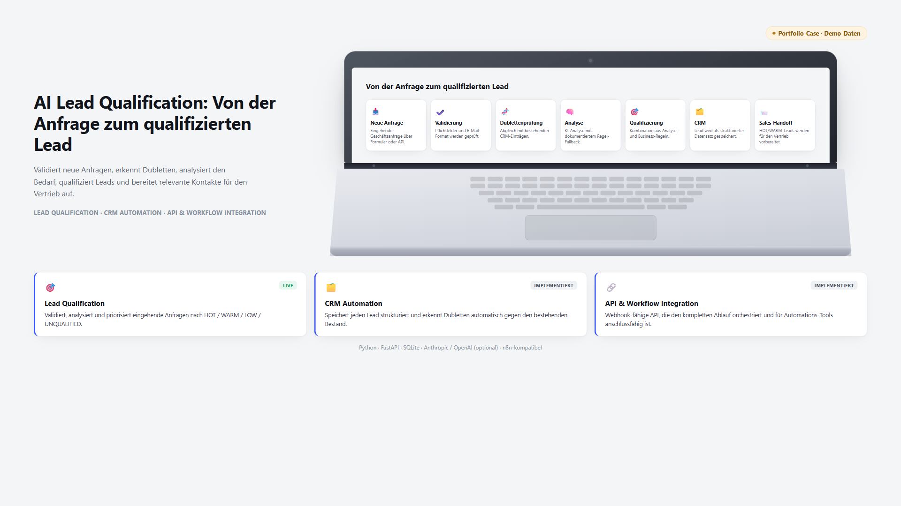
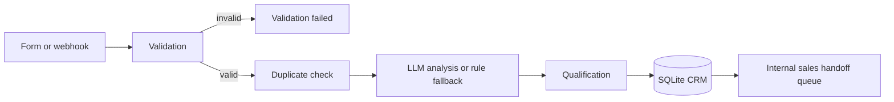
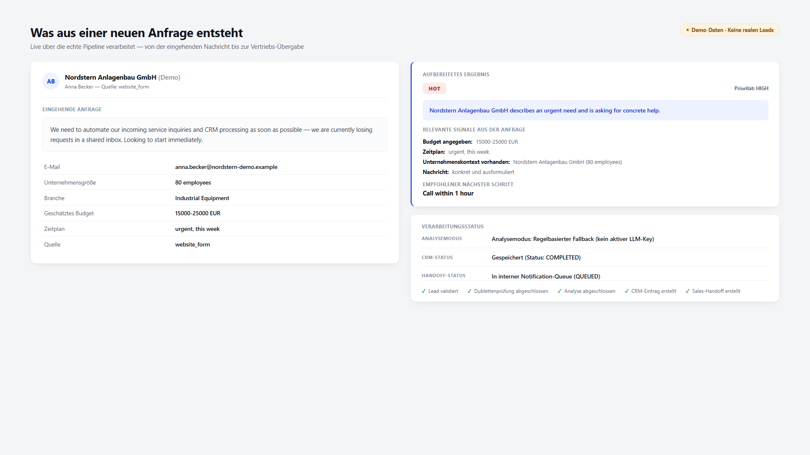
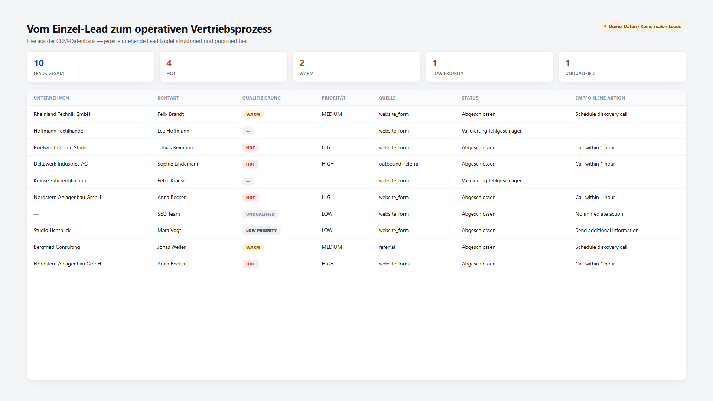
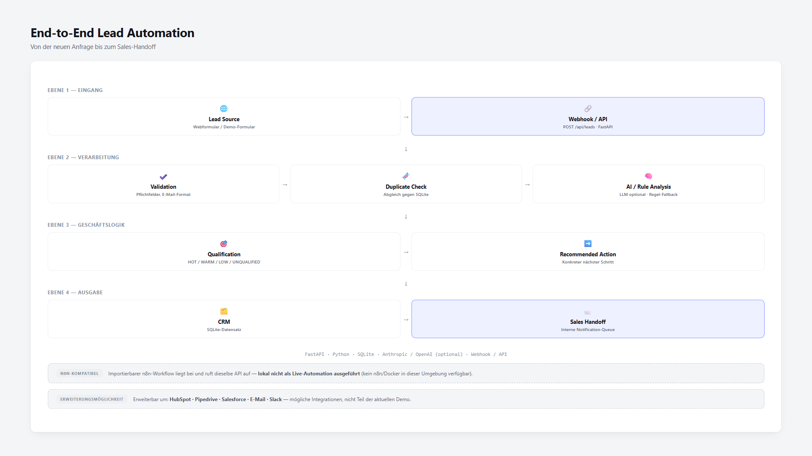

# AI Lead Qualification & CRM Automation



A working FastAPI portfolio project that turns an incoming business inquiry into a validated, deduplicated, qualified CRM record and prepares an internal sales handoff.

The pipeline is functional and tested. All people, companies, contact details, and results in the included demo data are fictional.

## What this project demonstrates

- Lead intake through a REST API or browser form
- Required-field and email validation
- Duplicate detection by email and normalized phone number
- Optional LLM analysis with Anthropic or OpenAI
- A transparent deterministic fallback when no API key is configured
- Qualification into `HOT`, `WARM`, `LOW_PRIORITY`, or `UNQUALIFIED`
- SQLite CRM persistence
- An internal handoff queue for qualified leads
- Automated API, database, validation, fallback, and qualification tests

## Architecture



The orchestration lives in `app/pipeline.py`. FastAPI exposes the pipeline and read endpoints in `app/main.py`.

## Verified demo status

Verified locally on 5 September 2026:

- `41` automated tests passed
- The included seed contains `10` fictional leads
- `8` leads complete the pipeline
- `2` leads are rejected by validation
- `1` duplicate is detected

The verified demo run used `fallback_rules` because no LLM key was active. The handoff is an internal SQLite queue; this repository does not claim that email, Slack, or an external CRM received a notification.

## Screens

<p align="center">
  
  
</p>
<p align="center">
  
</p>

## Quick start

Requires Python 3.10 or newer.

```bash
python -m venv .venv
```

Activate the environment:

```powershell
# Windows PowerShell
.venv\Scripts\Activate.ps1
```

```bash
# macOS or Linux
source .venv/bin/activate
```

Install and start the application:

```bash
python -m pip install -r requirements.txt
python -m uvicorn app.main:app --host 127.0.0.1 --port 8010
```

Open one of these pages:

- Portfolio dashboard: <http://127.0.0.1:8010/portfolio/index.html>
- Demo lead form: <http://127.0.0.1:8010/public/demo.html>
- Interactive API documentation: <http://127.0.0.1:8010/docs>

Populate the local CRM with fictional demo data:

```bash
python scripts/seed_demo_leads.py --base-url http://127.0.0.1:8010
```

## API endpoints

| Method | Endpoint | Purpose |
|---|---|---|
| `POST` | `/api/leads` | Validate and process a new lead |
| `GET` | `/api/leads` | List stored leads |
| `GET` | `/api/leads/{lead_id}` | Read one lead |
| `GET` | `/api/handoffs` | List internal handoff records |
| `GET` | `/api/stats` | Read pipeline statistics |

## Optional AI configuration

The project works without an external AI provider. Copy `.env.example` to `.env` only if you want to test an LLM integration:

```bash
cp .env.example .env
```

```env
ANTHROPIC_API_KEY=
OPENAI_API_KEY=
```

Anthropic is tried first when configured, followed by OpenAI. Provider errors and invalid model output fall back to deterministic rules. Every processed lead records its `analysis_mode`, so the active path remains visible.

Never commit a populated `.env` file.

## Tests

```bash
python -m pip install -r requirements-dev.txt
python -m pytest -q
```

GitHub Actions runs the same test suite for pushes and pull requests.

## Repository structure

```text
app/                 FastAPI application and pipeline logic
public/              Browser-based demo form
portfolio/           Live portfolio dashboard
scripts/             Demo seed script
tests/               Automated tests
n8n/                 Importable workflow definition
docs/images/         Portfolio screenshots
demo_leads.json      Fictional test and demo leads
```

## Scope and limitations

- This is a self-developed portfolio project, not a delivered customer system.
- Demo data is fictional and must not be interpreted as customer data.
- The n8n workflow is prepared and importable but was not executed against a local n8n instance during the verified run.
- Email, Slack, and third-party CRM delivery are not implemented in this demo.
- LLM classifications are a first-pass recommendation and should not replace human review in consequential sales decisions.

## Security notes

- Secrets belong only in a local `.env` file.
- Generated databases and logs are ignored by Git.
- Do not use production customer data with the demo setup.
- Review authentication, authorization, rate limiting, CORS, retention, and privacy requirements before adapting the project for production.
